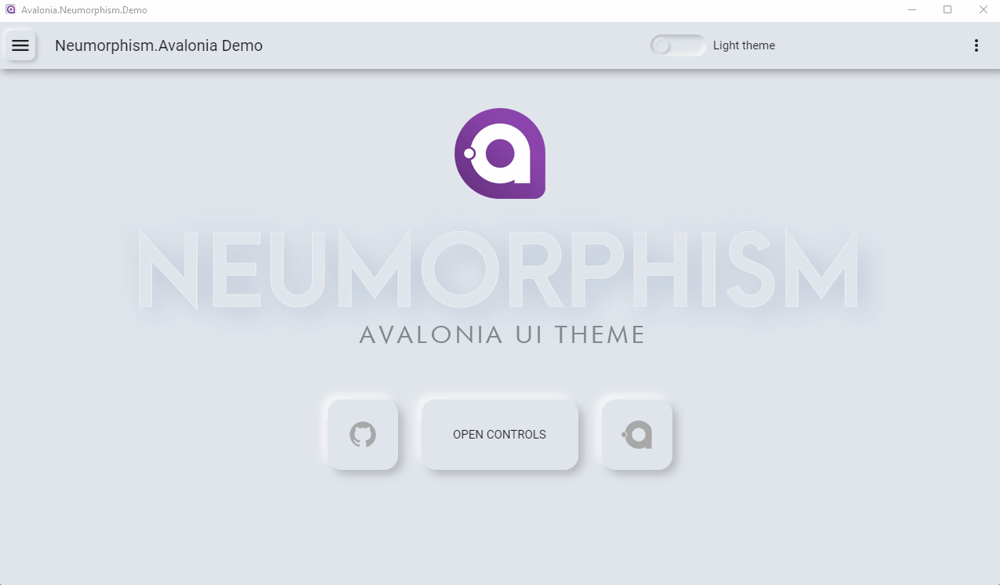
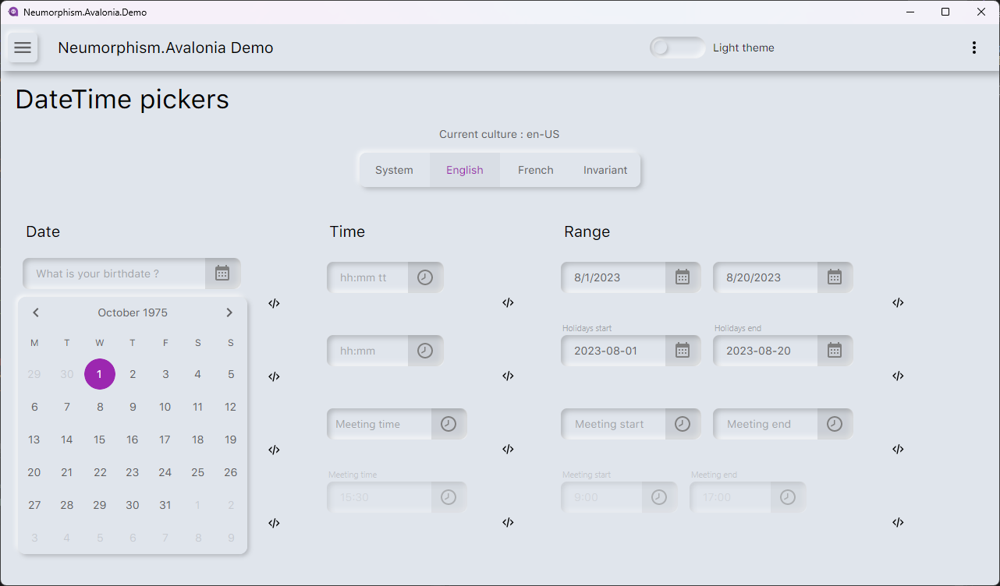
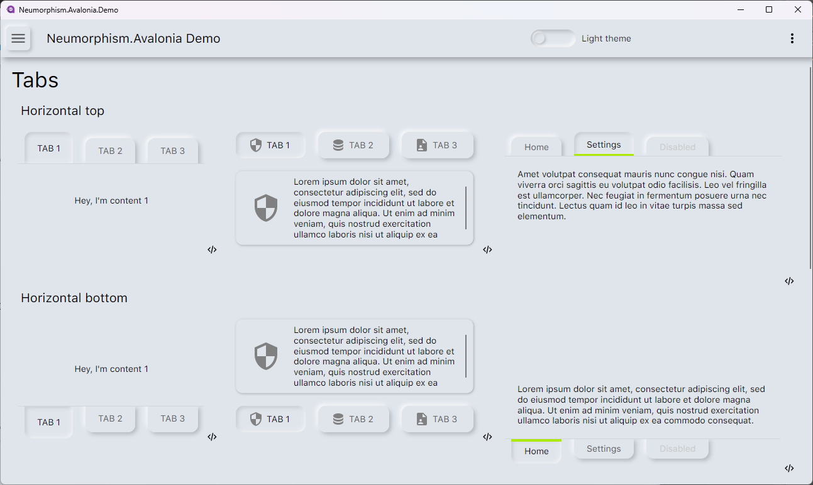
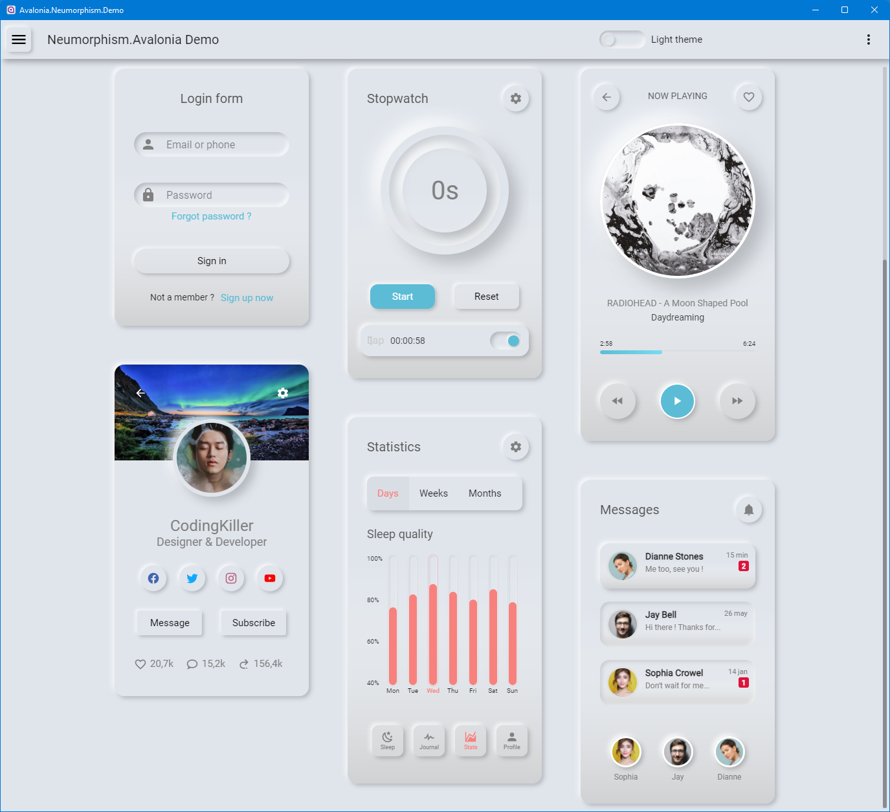
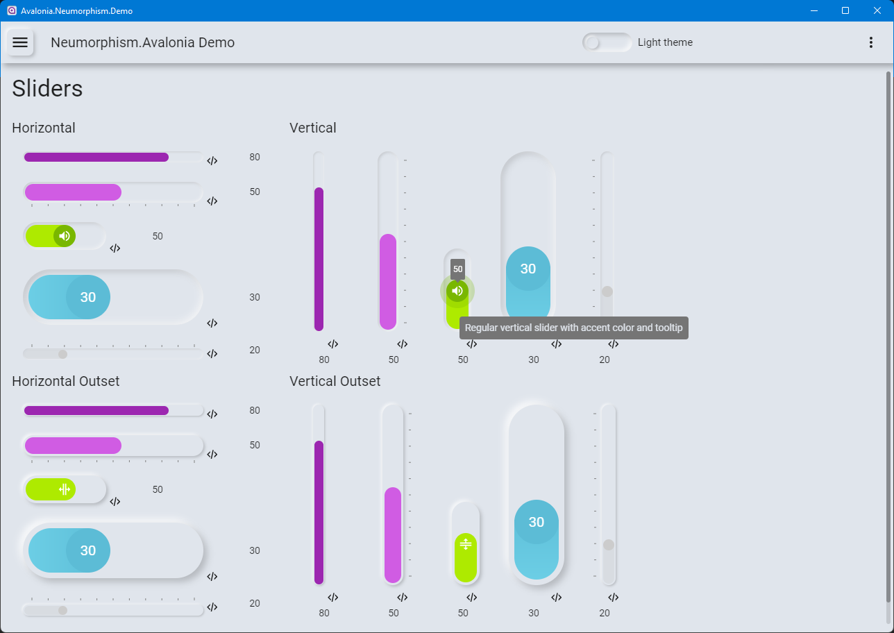
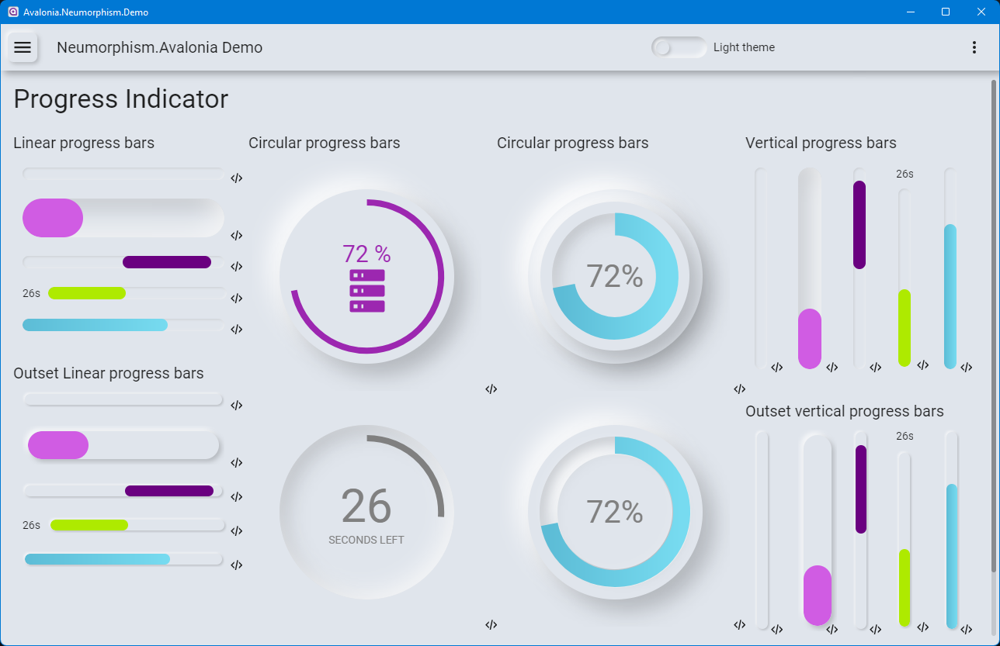

[nuget]: https://www.nuget.org/packages/Neumorphism.Avalonia/

#  Neumorphism.Avalonia

Easy to use and customizable Neumorphism Design implementation for [AvaloniaUI](http://avaloniaui.net/) framework.




#  DateTime pickers added in 0.7.0 !
- Calendar based date picker
- Time picker



#  Tabs added in 0.6.0 !
- Tabs are now fully themed with different possible styles



#  Avalonia 11 support in 0.5.0 !
- Totally rewritten for Avalonia 0.11 !
- Support Avalonia 0.11 Control Themes
- Works with native AOT compilation
- ListBoxes now fully themed
- Drawings page added in demo project

#  Cards and use cases added in 0.4.0 !
- Cards are now fully themed with 2 differents styles : outset (default) and inset
- Added real life use cases samples (login, stopwatch, audio player, messages, sleep quality, user profile...)



#  Sliders added in 0.3.1 !


#  Progressbars added in 0.2.1 !



#  Overview

This library is a collection of styles to help you build your Avalonia app with a ready to go Neumorphism Design theme.
(https://github.com/flarive/Neumorphism.Avalonia)


[][nuget]
[][nuget]


This Avalonia UI Neumorphic theme was inspired by another great Avalonia UI theme : [Material.Avalonia](https://github.com/AvaloniaCommunity/Material.Avalonia)

As neumorphism has no official specifications, this is my own personal interpretation of Neumorphism general guidelines i found on the web (mainly on [Dribble](https://dribbble.com/tags/neumorphism)).

It also uses some elements of Material Design such as :
- Primary and Secondary (Accent) color with light and dark variants
- A light theme and a dark theme (you can switch between them at runtime)
- Material Design Icons (must be installed separately)

For the moment only the following controls are fully themed :
- Buttons
- ToggleButtons
- RadioButtons
- Checkboxes
- Textboxes
- Comboboxes
- ProgressBars
- Sliders
- Cards
- ListBoxes
- Tabs

More controls should be themed soon.


#  Technical info

- Single .net Standard Library DLL (Avalonia.Themes.Neumorphism.dll)
- Can be used with .net Core 3.x, .net5, .net6, .net7, .net8...
- Lightweight (DLL is 1.5Mo when compiled in release mode)
- Built upon the latest version of Avalonia UI
- .Net 7 demo application project


#  How to start ?

1. Add [Neumorphism.Avalonia][nuget] nuget package to your project :

       dotnet add package Neumorphism.Avalonia


2. Edit your Avalonia project `App.xaml` file:

      ```xaml
      <Application ...
          xmlns:themes="clr-namespace:Neumorphism.Avalonia.Styles.Themes;assembly=Neumorphism.Avalonia"
          ...>
          <Application.Styles>
              <themes:NeumorphismTheme BaseTheme="Light" PrimaryColor="Purple" SecondaryColor="Lime" />
          </Application.Styles>
      </Application>
      ```

#  Licence

Neumorphism.Avalonia is free to use in any non commercial project.

If you like this project and want to help to maintain it, you can sponsor it (thanks a lot !)

<a target="_blank" href="https://www.patreon.com/NeumorphismAvalonia"></a>


